 

`MS · Survey and Data Science`
`MA · Psychology`

 

&nbsp;

---

*Not the cleverest survey,*
*not the cleanest sample,*
*just the design that reaches who gets left out,*
*that turns scattered responses into one honest answer*
*a decision-maker can actually use.*

*I ask the right questions.*

---

### Selected Projects

 

